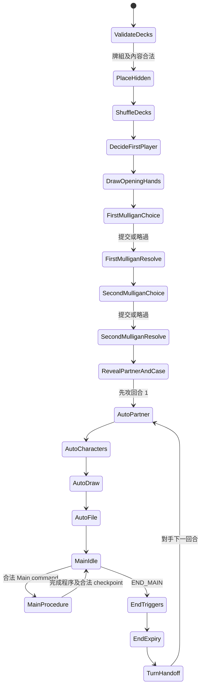
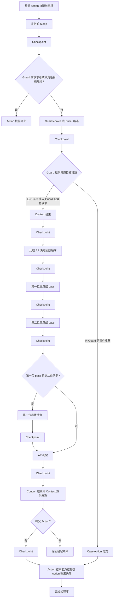
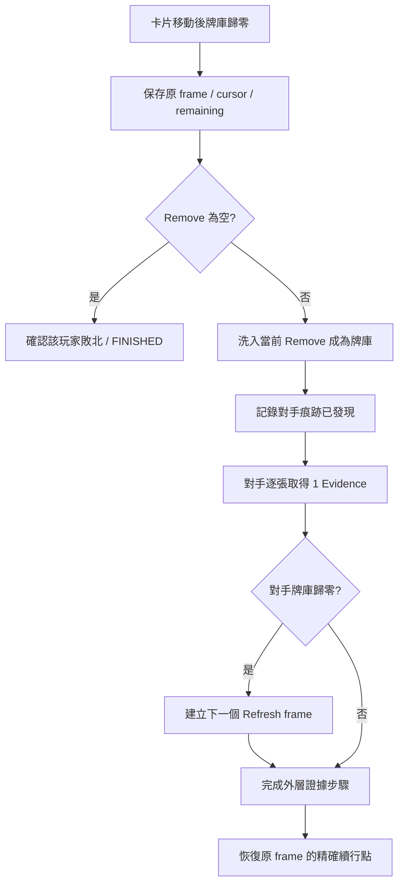

# Game Engine 流程、狀態機與測試計畫

Phase 4 補充：本機 UI 以 LocalController 提交 Command；getLegalActions 的 availability 由 Engine.preview 在副本 dispatch 得出，不會提交 RNG／state／events。每次指令後 bounded advance 到下一決策；restore 後 Ready 也會續行尚未完成的自動流程。choice.playerId 優先於 turn.playerId 決定交接對象；交接時 projection、actions、decision 全部清空。詳見 [phase4-results.md](phase4-results.md)。以下保留既有核心規則流程，未裁定新規則。

目前為 Phase 3A；設計與驗收見 [phase3a-plan.md](phase3a-plan.md)、[phase3a-results.md](phase3a-results.md)。Phase 1／2 結果保留作歷史驗收。RQ-011 已 RESOLVED，八個 BLOCKING 維持原分類。

狀態：Phase 3A 有限核心已實作。下文保留完整目標設計與原 89 項測試；目前實作以本節、Phase 3A 契約及驗收為準。沒有 UI 或連線服務。

## 目前引擎契約

- 公開 API：GameEngine.create／restore／getState／serialize／dispatch／advance／runUntilDecision。
- dispatch 處理一個意圖；advance 做一個自動微步；runUntilDecision 推到 Main、choice、阻擋或終局。每個提交的命令及自動步驟遞增 revision。步數耗盡回 STEP_LIMIT，不是官方终局。
- Setup 放置／洗牌／先後攻／抽五在 create 內完成並記有序事件；第一個可保存 choice 為先攻 Mulligan。兩人換牌完成才公開 Partner／Case。
- frames 是 JSON **程序續行陣列**，最後一個為當前子程序，保存 step／cursor／remaining，完成後恢復父程序。它是下方 frame-ID 圖的縮減表示，不含 callback；Action／Contact 保存參與卡片 ID，restore 驗證父子關係。
- pendingEffects 是獨立集合。EffectQueue 每次重算回合玩家優先權，CHOOSE_EFFECT 從該方候選任選；即使單一候選也開選擇，沒有強制 FIFO／LIFO，暫無 optional／pass。
- Event 先進 PROCESSING，解決自身 program，再進 Remove，再到 CHECKPOINT。新觸發不打斷目前 EFFECT。Auto 的 CARD_DRAWN 普通觸發保存 pending，於該 Auto 規則步驟完成後 checkpoint，不再以 RQ-011 阻擋。
- Auto：PARTNER → CHARACTERS → DRAW_ONE → FILE_ONE_OR_TWO → MAIN。Partner 在**自己的下一個 Auto 第一步**返回並 ACTIVE，對手 Auto 不搬回。
- Main：PLAY_CARD、NEXT_HINT、ASSIST、DEDUCE、DECLARE_ACTION、SOLVE_CASE、DECLARE_ABILITY、END_MAIN。keyword 為八種明示能力；有限宣言只接受明列 OWN_MAIN／NONE 成本，滿場登場透過 Switch 子程序。
- End：TURN_END → CHECKPOINT 全部解決 → expiry → 換人。移除本回合簡單 modifier；Contact modifier 在 Contact 結束失效，Action modifier 在 Action-end 效果完成後失效。expiry 觸發／重建同 scope 仍 RQ-023。
- MOVE 每次一張，先減 remaining 再建立 REFRESH。Refresh REBUILD→PENALTY→DONE，巢狀續行不覆寫外層；正好完成要求仍 Refresh。REMOVE_TOP 只處理指令開始時原本可移的數量。
- restore／完整 snapshot 是可信宿主 API。未提供 state setter、任意移卡或執行 opcode 的玩家指令。投影／網路／持久化服務仍待後續。
- 實際精簡目錄見 README；下方 §12 是後續提案。

## 核心行動流程與 checkpoint

所有流程由 Command → Validate → Rule Step → Emit Event → Detect Trigger → Queue Pending Effects → Resolution Checkpoint → State Transition 驅動。Rule Step 可包含數個事件；emit 只收集觸發，不搶先解決普通效果。

| 流程 | 實際續行／選擇 |
| --- | --- |
| Next Hint | NEXT_HINT.TAKE 取最上方非 Partner FILE 卡並重算 count → checkpoint → NEXT_HINT_CARD 選 0/1 張合法手牌 → Event 或登場／Switch → checkpoint → DONE |
| Switch | 只有登場超過五人時開 SWITCH；既有角色任何朝向均可選。FIELD→REMOVE（cause=SWITCH）與新角色 HAND→FIELD 為一次登場步驟，完成後才解 pending |
| Deduction | DEDUCTION_DECLARE（宣告已 Sleep）→ checkpoint → MISLEAD_WINDOW → EFFECT_CHECKPOINT → CALCULATE_LP → GAIN_EVIDENCE → GAIN_CHECKPOINT → DEDUCTION_END → checkpoint → DONE |
| Action | ACTION_DECLARE（宣告已 Sleep）→ checkpoint → GUARD_WINDOW → AFTER_GUARD／checkpoint → Contact 或 Case 分支 → ACTION_END → checkpoint → DONE |
| Contact | CONTACT_START → checkpoint → CONTACT_PRIORITY → checkpoint → CONTACT_RESPONSE（PASS／CUT_IN／DISGUISE，必要時先方重試）→ AP_COMPARE → checkpoint → CONTACT_END → checkpoint → DONE |
| Case 分支 | 頂 Evidence→PROCESSING → checkpoint → RELEASE_EVIDENCE 至 Remove → checkpoint → GAIN_EVIDENCE 己方 +1／Refresh → checkpoint → DONE |

GAIN_CHECKPOINT 是推理第二個 EFFECT_CHECKPOINT 的工程命名；DONE 用於等待結束觸發完成後回到父流程。沒有可用 Mislead／Guard 角色時自動跳過；否則開相應選擇，允許空選。選擇 id、actor、候選、來源及進度都寫入快照；此時拒絕其他 Main 指令。

Next Hint 可選本來就在手上的卡，亦可選剛拿回的卡；使用前按取回後的 FILE count 與 Case 全部色值重驗。可多次 Next Hint，第一次後 usedNextHint 即封鎖本回合通常手札使用。空 FILE 拒絕；FILE 僅 Partner 回 UnsupportedRule／RULE_QUESTION_009。

推理以 ACTIVE Partner 或合法 Character 宣告 Sleep；名乗り角色需要 RAPID。Mislead 對手一次選多張互異 ACTIVE 的 Field 角色，同批成本全數合法才 Sleep，X 合計只屬當次推理。兩個 checkpoint 的效果解完後才計算 LP；最終 LP≤0 給 0，否則 Deck top 逐張入 Evidence，index 0 為最新一張。中途最後一張立即 Refresh，恢復後完成剩餘量，再解普通觸發。來源離場需 RQ-012，不借用 Action 條文猜測。

Action 目標為對手 SLEEP／STUN Character，或至少有一張 Evidence 的 Case。Guard 為對手 ACTIVE Field Character，名乗り與 AP 大小不影響合法性，宣告後 Sleep。Contact 優先權由低 AP 方先、相同 AP 非回合方先；初次 priority 保存當時 AP，後续 modifier 不重排已開始的回應順序；AP 比較使用當時有效的加減修正。AP 比較先捕捉觸發，再於攻擊 AP≥防禦 AP 時移除防禦角色；攻擊者不因比較被移除。Contact 中任一參與角色離場直接走 Contact-end，不做 AP 比較；進入 Contact 前的邊界仍受 RQ-013 阻擋。

Contact 已支援有限 Cut-in／Disguise，流程見下節。Case 分支仍只允許沒有ヒラメキ能力的內容；進入分支後攻擊者離場不取消剩餘移除／證據步驟。完整替代／無效、任意卡文／成本／target／usage 系統仍未實作。

RQ-011：普通效果在當前完整 action／effect／atomic rule step 完成後才解決；同方任選，回合方有 pending 時優先，每解完一個重新判斷。來源離場／失效不刪除已觸發項目。replacement／negation 屬即時獨立路徑，本輪內容載入拒絕，絕不塞進一般 queue。

RQ-025：Assist Partner 計入 FILE，但 Next Hint 跳過；自己下一個 Auto 第一步返回並 ACTIVE。FILE 中推理、Ability 或重新 Active 後額外行為皆未支援。自動觸發適用性不明時保留 RULE_BLOCKED；不以勝負判定覆蓋阻擋。終局保存尚未執行的 frames／pending 作診斷，不再推進。

來源：官方 [Ver.2.5 PDF](reference/rule_manual.pdf)；精確規則、稽核及全部 RULE-QUESTION 見 [digital-rules.md](digital-rules.md)。型別與資料限制見 [card-schema.md](card-schema.md)。本文件大寫 state／command／event 名稱均為工程命名。

## Phase 3A 明示功能流程

### Contact 回應

1. CONTACT_PRIORITY 依當時 AP 保存 priorityAP 及先／後方；低 AP 先，同 AP 非回合方先。
2. FIRST：PASS，或合法 Cut-in／Disguise；使用後先完整處理其程序，再解該 checkpoint 的 pending。
3. SECOND：同上。若 FIRST 已使用，不再回到 FIRST。
4. FIRST_RETRY：僅 FIRST 曾 PASS 且 SECOND 使用時開啟。這不是可反覆回應的 stack。
5. 全部完成才 AP_COMPARE；任一參與者離場依 p.17 結束 Contact。

Cut-in：驗證 Hand 實卡／指定 ability → HAND→REMOVE → CUT_IN_USED → 指定一個 program → checkpoint。沒有 Case color 或 FILE Level 限制；卡在 Refresh 洗回牌庫後，獨立效果仍继续。能力失效時依 p.21 仍可使用，但該無效效果不執行。

Disguise：驗證明示能力／本輪可確認可用性 → 專用 replacement → 舊卡裏置牌庫底、新實卡建立 occurrence 並接續 Contact → DISGUISED → checkpoint。繼承朝向、received effects、外來 grants、Set、underneath；不發 CHARACTER_ENTERED，不以普通離場清理刪掉附件。能力失效不可使用。跨色／超 Level 回 RQ-010，MR 交互回 RQ-019，曾一般離場實卡的未知能力／重入語義回 RQ-027。

### Identity、MR 與附件

FieldEntry 的 PLAY／DISGUISE、PRESENT／LEFT／REPLACED 是 ENGINE ARCHITECTURE。一般離場封存 occurrence，不重綁舊 SOURCE；需要讀舊来源則 RQ-014。新增 occurrence 不代表 Turn1 或所有 modifier／target 重設。

普通 MR 登場走登場事件，再依 p.26 移除既有 Field／Partner MR；Field 移除的 cause=MR_ABILITY。對手回合 MR 離場先完成原目標區移動，再立即到 Partner；普通 pending 不插入這兩次移動之間。己方回合不轉往 Partner。不建立「全域隨時最多一張」invariant；多 MR 批次、對手回合新 MR 競合、變裝／下疊及其他即時規則競合不由 handler 順序裁定。

Partner MR 不可 Deduction／Action，只觀察明列 PARTNER 的 trigger；有限 DECLARE_ABILITY 也需卡文 descriptor 明列區域、OWN_MAIN、NONE 成本。宣告事件先偵測 pending，指定 program 完成後才 checkpoint。其他時機／成本／限次的 program 不開放，原 Partner 在 FILE 的能力仍 RQ-025。

SET_CARD／STACK_UNDER 使用獨立容器與 hostEntryId；目前來源限牌庫頂，不將現場角色變成下疊來猜 RQ-027。正常宿主離場後其兩類附件走正式移動管線到 Remove、裏向 Set 表置；Disguise 專用替換保留附件。多張 Set 的 MOVE 保存 remaining，立即 Refresh 後續行。

### Investigate、TRACE 與 keyword

INVOKE_KEYWORD INVESTIGATE_X → REVEAL（對手 Deck 原頂至多 X 張，仍在 Deck）→ ORDER choice（由被調查玩家選完整排列）→ 原子置於 Deck 底／裏向 → EFFECT.foundCards 保存最初公開批次 → 繼續 program → checkpoint。少於 X 就使用可用張數，不因暫時提取整副牌而製造 Refresh。ORDER 中途可保存與恢复；快照核對父 effect 指令、controller、source 與固定 X。

TRACE 是玩家持續事實：對手 Refresh 後該玩家已發現，後來自己的 Refresh 不取消。trigger.condition 控制觸發資格；program.condition 在解決時讀取「若已發現」。完整条件 DSL 未實作。

RAPID 開放新登場推理與 Action；ASSAULT 只 Action；指定型限制角色／Case；BULLET 不開 Guard 候選；MISLEAD_X 沿用同批 Sleep 與本次固定減值。keyword 不按卡名識別，重複同種仍 RQ-028。已支付 Mislead／已觸發 Investigate 使用有限 profile 的固定能力文字與保留 grant，不重新判斷印刷能力是否有效；一般動態數值仍未授權。

### 簡單 duration 與停止點

CONTACT_END：先移除本 Contact modifier，再記 CONTACT_ENDED、checkpoint。
ACTION_END：先記 ACTION_ENDED、checkpoint，再移除本 Action modifier。
TURN_END：先記 TURN_END、checkpoint，再移除本 Turn modifier，換人。

不允許 expiry 產生新 trigger、重建正在關閉的 scope 或重新開窗口：RQ-023。LP 已進入證據張數步驟而要求改變計算值：RQ-012。其他八個 BLOCKING 的拒絕與 RULE_BLOCKED 保持原界線；不是遊戲規則的「略過效果」。

新增測試對照：UT-036–044、054、061／064／066、068–073、076、078／081／084／088 的已明示子集；詳見 phase3a-results.md，原 backlog 未全數結案。

## 1. 架構選擇

| 方案 | 優點 | 代價／限制 |
| --- | --- | --- |
| **純 transition 函式 + 顯式程序 frame + 宣告式效果 program（建議）** | 狀態皆是資料，易保存中途選擇、測試、重播；可精確對齊官方箭頭 | 必須設計續行點、effect interpreter 與 invariant |
| 外部 state machine 函式庫 | 圖形化／階層狀態工具較完整 | 必須確認 actor、timer、內部 context 全可重建；不能直接序列化函式庫 runtime |
| 大型可變 Game／Card 物件與 callback | 初期少量程式較直觀 | callback、閉包、跨物件引用不利於中途序列化及 authoritative 驗證，不採用 |

Phase 1 採第一方案：封裝 GameEngine 持有 state，每次在獨立 draft 執行 transition 並驗證後提交。使用 TypeScript／Node.js；下方完整 API 提案尚未全部實作。

## 2. 引擎入口與依賴方向

```text
未來 UI / CLI / 測試 / Transport adapter
                  │ Command（意圖）
                  ▼
           Game Engine 公開 API
           ├─ 驗證 actor、revision、phase、choice、規則
           ├─ 程序 transition 與 effect interpreter
           ├─ 產生下一份 AuthoritativeGameState 與 events
           └─ 依角色產生 PlayerView
                  │
                  ▼
    未來 Server persistence / reconnect / replay adapter
```

Engine 不 import UI、DOM、socket、HTTP、database、clock 或全域亂數。Card Definition 是只讀輸入，不放在可變卡片物件裡。Adapter 不可直接改 `field`、AP、手牌或 pendingEffects。

預計介面契約（型別形狀是設計，不是已存在 API）：

| API | 輸入 | 輸出與責任 |
| --- | --- | --- |
| `createMatch` | 驗證後牌組、玩家座位、固定版本、受控隨機初始狀態 | Setup state；只分配實卡身份，不跳过洗牌／先後攻／換牌步驟 |
| `dispatch` | `state, command, immutableContext` | Accepted：下一 state、提交 events；Rejected：結構化錯誤，輸入 state 不變 |
| `advance` | `state, immutableContext` | 執行已知自動步驟直到玩家選擇、MAIN_IDLE、終局或 RULE_BLOCKED；不得把一個技術步數上限當官方終局 |
| `listLegalCommands` | `state, actorId, immutableContext` | 該 actor／該窗口可做的意圖；是輔助查詢，dispatch 仍須完整驗證 |
| `projectView` | `state, viewerRole, knowledgePolicy` | 經遮蔽的 PlayerView／ObserverView，不傳完整 state 再讓前端藏欄位 |
| `serialize / restore` | schema version 與 state JSON | 驗證後完整往返；未知版本拒絕，明確 migration 另版本管理 |
| `replay` | 初始 snapshot、版本固定的 commands／random 記錄 | 重建相同 state 與 event sequence；不是依 UI 動畫重播 |

`immutableContext` 包含 content manifest、ruleset 與 program registry；context 不進 GameState，但 state 必須含其版本／hash，恢復時精確載回。所有會影響遊戲結果的 runtime 數值與進度都必須在 state。

### 2.1 Command 契約

Envelope：`matchId, commandId, actorId, expectedRevision, payload`。`payload.kind` 例如：

- `SUBMIT_MULLIGAN`：只包含目前玩家手中互異 instanceId，空陣列代表不換。
- `USE_HAND_CARD / NEXT_HINT / ASSIST / SOLVE_CASE / DECLARE_ABILITY / DEDUCE / DECLARE_ACTION / END_MAIN`：僅 MAIN_IDLE 的回合玩家。
- `ANSWER_CHOICE`：`choiceId` 及 selector 選擇，限目前指定玩家；選擇順序、目標與 skip 都由 choice schema 驗證。

Client 不傳「AP 判定成功」「增加證據」「我贏了」等結果指令。未來 Server 從登入身份取得 actor，不相信 client 聲稱的 actorId；同一 match 單序列處理 command，成功時遞增 revision。Transport 實作本階段不建立。

重送相同 commandId／相同 payload 回傳已記錄結果；相同 ID 不同 payload 拒絕；舊 revision 拒絕並可要求同步。不合法 command 不消耗亂數、不付成本、不遞增規則計數。合法程序已開始後，後续錯誤答覆只拒絕該次答覆，不撤回先前合法效果。

### 2.2 Event 與隨機性

Event 表示已發生的事實，例如 `CardMoved`、`OrientationChanged`、`AbilityTriggered`、`ChoiceOpened`、`EffectResolved`、`CaseStageChanged`、`MatchEnded`。用遞增 sequence，不用 wall-clock 決定規則順序。每個事件帶 `procedureId, cause, sourceRef` 及需要的 before／after 資訊；觸發偵測不能只拿修改後 state 猜測發生了什麼。

Server 持有版本固定的 PRNG algorithm／state／cursor；每次洗牌、先後攻隨機結果都入受保護記錄。不在 reducer 呼叫 `Math.random()` 或 `Date.now()`。Replay 可由同版本隨機狀態重演，並用已記錄 permutation／outcome 交叉校驗。seed、牌庫排列、完整事件不可交給玩家，否則可以推算未抽到的牌。

## 3. 狀態分層

避免單一超大 enum 組合所有資訊。`machine.status` 表示比賽生命週期；`turn.phase` 表示正式三 phase；`activeFrameId` 表示目前程序；選擇權屬於 `awaitingChoice.actorId`，不總是 turnPlayerId。

| 維度 | 值／用途 |
| --- | --- |
| Match status | `SETUP / PLAYING / RULE_BLOCKED / FINISHED` |
| Phase | `AUTO / MAIN / END`；Setup 時為 null |
| Procedure frame kind | `SETUP / AUTO / MAIN_ACTION / NEXT_HINT / CARD_USE / ENTRY / DEDUCTION / ACTION / CONTACT / CASE_ACTION / EFFECT / CHECKPOINT / REFRESH / END` |
| Frame step | 可辨別 union 中列出的合法 step；禁止任意字串跳轉 |
| Choice | mulligan、Switch、Next Hint 用牌、Mislead、Guard、Contact 回應、pending 選序、效果目標／可選分支／捜査底序 |
| Rule block | 問題 ID、候選操作、凍結步驟、blockedFrameId；不是 FINISHED |
| Outcome | 明確勝／敗結果與原因；不預設平手規則 |

### 3.1 Frame 與續行資料

每個 frame 有 `frameId, kind, step, parentFrameId, returnTo, locals`；`returnTo` 是 `{frameId, step}` 的資料，不是 function。`frames` 是依 ID 的 record，`activeFrameId` 指定目前執行者。父子關係用於程序恢復，**不代表 pending effects 依 LIFO 解決**。

至少保存：

- `ACTION`：攻擊者身份、原目標、Guard 者、是否已跨 Guard、分支、actionId。
- `CONTACT`：目前雙方角色引用、order、已行動玩家、firstPassed、secondActed、contactId、可空的 parentActionId。
- `DEDUCTION`：来源引用、選定 Mislead、已確認的 LP 取值、targetQuantity／remaining、deductionId；未定取值不填猜測值。
- `EFFECT`：effectInstanceId、programId／version、instructionCursor、bindings、已做選擇、目前操作剩餘量。
- `REFRESH`：刷新玩家、原操作、對手證據步驟、returnTo。巢狀 Refresh 另建 frame，不覆蓋外層。
- `CHECKPOINT`：合法 drain 時點、返回位置、currentlyResolvingEffectId；使用者選擇完成後重新求 pending 優先權。

選擇權與「下一個合法 step」必須可一起還原。不能只保存 `phase=MAIN` 後重連就放玩家再下 Main 指令。

## 4. Setup 與 phase state machine



此圖只列大流程。每張牌移動都可遇到立即 Refresh；遇到需選擇就暫停該 frame；遇到未定規則進 RULE_BLOCKED，已確認終局進 FINISHED。這些是跨流程轉移，不需要在所有圖中複製箭頭。

| State | 入口／合法輸入 | 完成條件及下一步 |
| --- | --- | --- |
| ValidateDecks | 工程輸入驗證，PDF p.7 | 非 40 張、錯卡種、同印刷 ID >3 拒絕建立；未知卡／未支援效果不可默默通過 |
| PlaceHidden／Shuffle／DecideFirst | 引擎自動執行，p.9 | Partner／Case 裏置，亂數結果記錄；不是勝者自行選先後攻 |
| MulliganChoice | 只接受該先後攻座位，p.9 | 選取互異手牌，回牌→洗牌→等量補抽，再進下一位；完成後不可再次換 |
| AutoPartner | 無玩家 Main 輸入，p.10 | Assist Partner 僅在自己的下一個 Auto 第一步返回 Partner Area 並 ACTIVE；對手回合不返回 |
| AutoCharacters | 無玩家 Main 輸入，p.10 | 自己 Field 狀態轉換；整個角色 Active 步驟完成後 checkpoint，依 RQ-011 確認 |
| AutoDraw／AutoFile | 一張一張移動，p.10、20 | 抽 1；FILE 先攻第一回合 1，其他 2；剩餘量到 0 後仍先處理剛觸發的 Refresh |
| MainIdle | 六類行動或 END_MAIN，p.11 | 選擇具體程序，沒有通用「回應任意指令」窗口 |
| EndTriggers | 發動回合結束能力，p.10、22 | 完成合法 pending 解決，再使到回合結束的效果失效 |
| TurnHandoff | p.10、25 | 更新 turnId／player，重設每回合旗標及首批登場追蹤；名乗り状態以 turnId 派生 |

## 5. Main 子程序

| 程序 | Step 順序 | 需要保存／暫停之處 |
| --- | --- | --- |
| 通常用牌 | 驗證 → Character 容量／登場，或 Event 處理中／解決／目的地 → 合法 checkpoint → 完成 | 已消耗通常使用旗標、使用來源、Switch、Event effect cursor |
| Next Hint | 驗證 FILE → 取頂部非 Partner 卡 → 選擇用 0/1 張 → 取走後 Level／色驗證 → CARD_USE → 完成 | `turnLedger[playerId].usedNextHint`、取得卡參照、專屬用牌 choice；不可開第二個 Main action |
| Assist | 驗證可付成本 → Sleep／移 FILE → 當下含 Partner ≥7 強制解決編 → 完成 | Partner 的單一實體位置；不能數到第 7 張時在所有流程自動翻 Case |
| 事件解決 | 驗證解決編與成本 → 宣告／Sleep → 比較對應事件等級 → 勝利或完成 | 比較前后的明確狀態；不因一般 EvidenceChanged 自動勝利 |
| 宣言 | 驗證來源區／有效性／限次／全成本 → 支付 → EFFECT → 完成 | 成本與效果的因果不同；效果自身選擇不算新的宣言 |

RQ-011 已確認：每個 action／effect／atomic rule step 完成後 checkpoint。Next Hint 取卡後先解 pending 再選卡；Switch 移除與新角色登場為同一登場步驟後 checkpoint。複合成本內部順序仍是 RULE-QUESTION-015。

## 6. 推理狀態機

`CP` 表示官方圖中箭頭的 pending-effect checkpoint（p.15）。Refresh 是立即處理，與 CP 的普通效果集合不同。

```text
DEDUCTION_VALIDATE
  → DEDUCTION_DECLARE_AND_SLEEP
  → CP
  → MISLEAD_CHOICE（對方選一組合法角色，或空組）
  → MISLEAD_APPLY（同時使用，保存本次 LP modifier）
  → CP
  → EVIDENCE_GAIN_BEGIN（合法且可確認的 LP 值）
  → EVIDENCE_GAIN_ONE × remaining
       └─ 牌庫空：REFRESH → 回到精確 remaining
  → CP
  → DEDUCTION_END（本次 Mislead modifier 失效）
  → MAIN_IDLE
```

普通 pending effects 在證據獲得這個流程項目完成後的 CP 處理，不在每拿一張時任意拆開原效果；立即 Refresh 仍逐張檢查。若來源已不在預期位置或取值受中途效果改變且文件無法確認，進 RULE_BLOCKED（RULE-QUESTION-012、014）。

## 7. Action／Guard／Contact 狀態機



圖的額外 guard：Contact 開始後每次繼續前檢查參與角色；任一離場就直接到 CE，不執行尚未完成的回應／AP（p.17）。Disguise 原卡離場與新卡替換屬同一規則程序，先更新 Contact 參照，不誤判成空參與者。

`Early` 是 p.16 的即時終止，不等同完整 AP/Contact 流程；是否必須另發 Action-end 觸發的邊界沒有明文，歸入 RULE-QUESTION-013，不能透過共用 cleanup 自動補出官方未確認觸發。

Contact 回應真值表（每個 `act` 是一次 Cut-in 或 Disguise，不是未解決效果的數量）：

| 第一位 | 第二位 | 第一位再回應 | 下一步 |
| --- | --- | --- | --- |
| pass | pass | 無 | AP |
| act | pass | 無 | AP |
| act | act | 無 | AP |
| pass | act | 可 act 或 pass 一次 | AP |

第一位選 Cut-in 後，其效果先解決到合法結算點，第二位才作選擇。不能先收雙方牌，再以 stack 倒序解決。

### 7.1 Case Action 分支

```text
REMOVE_TOP_EVIDENCE_TO_PROCESSING
  → CP
  → INSPIRATION_CHOICE（該 Evidence 擁有者）
  → 可選 EFFECT；結束／拒絕後移至 Remove
  → CP
  → ACTOR_GAIN_ONE_EVIDENCE（可立即 Refresh）
  → CP
  → ACTION_END_TRIGGERS
  → 解決 pending
  → ACTION_DURATION_EXPIRE
  → 完成
```

此分支中攻擊者離場仍繼續全部剩餘步驟（p.19）。沒有ヒラメキ也要完成卡移入 Remove 的步驟。是否已無最上方 Evidence 等未定邊界先暫停 RULE-QUESTION-013，不能憑空造牌。

## 8. 效果 scheduler 與即時處理

### 8.1 一般未解決效果

在官方允許的 CP：

1. 目前效果尚未解決完時，不選別的普通 pending effect。
2. 有 turn player pending，就只允許該玩家從自己的 pending IDs 選一個。
3. 否則有 non-turn player pending，由該玩家選一個。
4. 選中後建立 EFFECT frame 並從 pending 集合取出；依 program 執行到完成或等待選擇。
5. 新觸發加入 pending 集合；目前效果先完成，再回到第 2 步重新判優先權。
6. 都沒有時返回 CP 保存的續行點。

單一合法 pending 可自動選定，但不能在多個效果時用 ID、入列時間、卡名或先進後出替玩家選序。可選效果分支的 choice 在結算時建立，不是在觸發時提前詢問。

### 8.2 候選事件與已發生事件

```text
instruction / 規則步驟提出 proposed event
  → 檢查適用的即時 replacement／negation
      ├─ 唯一且語義已確認：改寫／阻止該事件
      └─ 競合無裁定：RULE_BLOCKED，保留 proposed event
  → 提交實際發生的狀態變動與 fact event
  → 以 before / after / cause 捕捉普通觸發
  → 執行已確認的即時後續規則（例如 MR 的非替代轉區）
  → 遇牌庫歸零立即 Refresh
  → 只有合法 CP 才開始一般 pending 解決
```

這是職責分離圖，不是 p.20、22、26 所有即時規則之間的通用優先順序。若同一提交同時引出 MR、Refresh、replacement 競合，停在 RULE-QUESTION-020；不能把程式圖上的列序當裁定。被替代而未發生的動作不能產生其「已發生」普通觸發；替代動作本身可依已確認語義發出自己的事實。

## 9. Refresh interrupt 與恢復



每次成功移動一張後，先更新 `remaining`／instructionCursor 再保存中斷點；恢復不重做已移動的卡。即使 remaining 剛到 0，也不能漏掉 Refresh。`LOOK/REVEAL` 不搬出牌庫，不能因看完全部卡誤判空庫。頂 N 張移除效果與逐張抽牌的續行策略不同，不能只靠一個通用 `takeN`（p.20）。

FINISHED 截止所有後續規則動作，包括原程序剩餘抽牌／未解決效果；同步結果無法裁定時用 RULE_BLOCKED，不能先選一位輸家。技術 exception 與官方敗北分開記錄。

## 10. Online、Reconnect、Replay 的預留契約

這裡只定義需要保留的資訊與界線，不建立網路服務。

- **Server authoritative**：Server 唯一持有完整 state、隱藏卡順序及隨機狀態，驗證所有 command 並依規則產生結果。UI 僅顯示投影與發送意圖。
- **Reconnect**：Server 由 snapshot + 後續 command log 恢復完整程序；驗證使用者身份後回傳目前 revision、該玩家 view、其可回答 choice。不能為了同步傳整副牌庫或把 pending choice 重設。
- **Replay**：固定 `stateSchemaVersion, engineVersion, rulesetVersion, contentHash, programVersion, rngAlgorithm`；相同初態與合法 commands 得相同事件／stateHash。舊版由舊 runtime 重播，或顯式 migration，不暗中用新卡文。
- **隱藏資訊**：完整 replay／snapshot 是受保護的 authoritative 資料。玩家用經遮蔽的 events／view；捜査公開卡不等於公開底部排序；裏向 Set 不對擁有者公開。RULE-QUESTION-021 未解之前，不宣稱完整視野規則已完成。
- **斷線／逾時**：connection status、心跳及 wall-clock 在 adapter；本手冊未定義斷線自動 pass／認輸，不在引擎增加這些比賽規則。
- **相容性**：unknown command、未知 opcode、未知 snapshot version、內容 hash 不符都明確拒絕，不默認跳過。

## 11. 第一階段需要建立的 unit tests

以下保留原 **89 項測試設計清單**。Phase 1 從中選出 28 組 P0，加上 5 組回歸；Phase 2 再建立 30 組主要行動測試與 8 組回歸；Phase 3A 增加 53 組。使用 Node 內建 test runner 與 TypeScript。本輪對照見 phase3a-results.md，不能把關聯測試通過視為完整 UT 已完成。

使用最小合成 fixture 表達已確認規則，不假裝是實際官方卡片。每個 fixture 標註 PDF 頁碼與所需 opcode；卡片文法尚未核實的真卡不寫成猜測 expected。所有成功案例也檢查實卡守恆、單一位置、場上穩定上限、pending ownership 與 JSON 往返。

### 11.1 已確認規則測試

| Test ID | 預計檔案 `tests/rules/` | 輸入／操作 → 必須斷言的結果 | 依據 |
| --- | --- | --- | --- |
| UT-001 | deck.test.ts | 主牌組 39／40／41 張 → 僅 40 合法 | p.7 |
| UT-002 | deck.test.ts | 異圖同印刷 ID 共 4 張 → 拒絕；3 張合法 | p.7 |
| UT-003 | deck.test.ts | 主牌組含 Partner／Case → 拒絕；各一張外置符合 | p.7 |
| UT-004 | deck.test.ts | 混色主牌組、Partner 與 Case 不同色 → 不以組牌色規則拒絕 | p.7 |
| UT-005 | zones.test.ts | 第 6 角色不得直接落穩；可同名共存；己卡移對手區拒絕 | p.8、12 |
| UT-006 | setup.test.ts | 起始順序完整事件軌跡 → 公開在兩人換牌之後，先攻先選／先完成 | p.9 |
| UT-007 | setup.test.ts | 換 0／2／5 張 → 最終手牌仍 5，選中卡先回牌庫洗牌後抽；不可第二次換 | p.9 |
| UT-008 | auto.test.ts | Assist Partner 在 FILE，對手 Auto 不返回；自己的下一個 Auto 第一步先回 Partner ACTIVE，此時角色／抽牌／FILE 補充尚未執行 | p.10；AUDIT-01；Phase 1 使用者確認 |
| UT-009 | auto.test.ts | 先攻首回合抽 1、FILE 1；後攻首回合及以後各抽 1、FILE 2 | p.10 |
| UT-010 | zones.test.ts | 依序放 FILE／Evidence A 再 B → 頂為 B，順序不反轉 | p.10、15 |
| UT-011 | orientation.test.ts | ACTIVE／SLEEP／STUN 的三種指令組合 → DR-02 九格表；STUN Sleep 成本拒絕 | p.6、14 |
| UT-012 | stats.test.ts | Level／AP／LP 變負 → 不自動移除，序列化保留負值 | p.4 |
| UT-013 | hand-use.test.ts | 通常使用第 1 次成功，第 2 次拒絕；未移除 FILE 作費用 | p.11 |
| UT-014 | next-hint.test.ts | Next Hint 後通常使用拒絕；通常使用後 Next Hint 可用；Next Hint 可連用至資源邊界 | p.11–12 |
| UT-015 | next-hint.test.ts | FILE 4 拿 1 後嘗試 Level 4 → 拒絕該用牌選擇；Level 3 可用 | p.12 |
| UT-016 | next-hint.test.ts | FILE 含 Partner 和兩張普通卡 → Partner 計數但不拿入手；取最上方普通卡 | p.11–12 |
| UT-017 | next-hint.test.ts | 選新拿手牌／舊手牌／略過 → 各正確；不保留使用權，兩步間 Assist 拒絕 | p.12 |
| UT-018 | next-hint.test.ts | 真正空 FILE → 不可宣告；只有 Partner 的 fixture 標 RULE-QUESTION-009 | p.12 |
| UT-019 | color.test.ts | 單色匹配／不匹配；雙色只匹配其一 → 拒絕；雙色全有 → 允許 | p.12 |
| UT-020 | color.test.ts | 效果登場／Cut-in／ヒラメキ跨色 → 不套通常使用的 Case 色限制 | p.12、18–19 |
| UT-021 | switch.test.ts | Field 5，替換任意朝向既存角色 → 移除後新角色登場；Field 4 單卡進場不可 Switch | p.12 |
| UT-022 | partner.test.ts | FILE 6 加 Partner → 強制解決編；FILE 5 加 Partner → 仍事件編；日後降 FILE 不回復 | p.5、13 |
| UT-023 | partner.test.ts | 非 Assist 的 FILE 變 7 → 不自動轉解決編；解決編但證據達標 → 不自動勝利 | p.5、13 |
| UT-024 | partner.test.ts | ACTIVE Partner 使用事件解決，先／後攻對應等級達標 → 勝利；事件編或不能付 Sleep → 拒絕 | p.13 |
| UT-025 | partner.test.ts | 解決編宣告並 Sleep，Evidence 未達等級 → 不產生勝利 | p.13 步驟原文 |
| UT-026 | declare.test.ts | 新登場角色可宣言；無 Sleep 成本的 Sleep／Stun 角色可用；需 Sleep 則拒絕 | p.14、25 |
| UT-027 | costs.test.ts | 成本不足，或選對手卡付費 → 拒絕且狀態不變；全部可付才解決效果 | p.14 |
| UT-028 | costs.test.ts | 成本移除己方角色 → 不觸發限定「自己的能力／效果移除」；能力移除可滿足 | p.14 |
| UT-029 | deduction.test.ts | 新登場無迅速不能推理；迅速可；突撃不可；重新 Active 可再次推理但仍檢查名乗り | p.15、25 |
| UT-030 | deduction.test.ts | LP 為 -1／0／2 → 得 0／0／2 張，逐張裏置，先攻首回合允許 | p.15 |
| UT-031 | mislead.test.ts | 對方同時選兩張有效 ACTIVE Mislead → 都 Sleep、合併降低此次 LP，推理結束恢復 | p.25 |
| UT-032 | action.test.ts | 合法 ACTIVE 成熟角色可攻 Sleep／Stun 角色，不可攻 Active 角色或零 Evidence Case | p.16 |
| UT-033 | keywords.test.ts | 迅速／突撃／突撃[キャラ]／突撃[事件] → 只開放相應名乗り限制，不強制立刻 Action | p.25 |
| UT-034 | guard.test.ts | 新登場低 AP 的 ACTIVE 角色可 Guard 並 Sleep；Sleep／Stun 不可；Bullet 不開 Guard | p.16、25 |
| UT-035 | action.test.ts | Guard 前攻擊者／原角色目標離場 → 不再 Guard／Contact／AP；未定終止觸發另外阻擋 | p.16；RULE-QUESTION-013 |
| UT-036 | contact.test.ts | Action[角色] 未 Guard 與原目標 Contact；任一被 Guard 改與 Guard 者 Contact | p.17 |
| UT-037 | contact.test.ts | AP 低方先；AP 平手非回合方先；第一位加 AP 後不重排行動順序 | p.17 |
| UT-038 | contact.test.ts | 覆蓋 §7 四列 pass／act 表；每人至多一張 Cut-in 或 Disguise，不可兩者都用 | p.17–18 |
| UT-039 | contact.test.ts | 第一位回應效果先解決，第二位讀到該結果；不可逆序處理兩張 | p.17、22 |
| UT-040 | contact.test.ts | 攻擊 AP 小於／等於／大於防守 → 僅等於、大於移除防守；攻擊者從不因比較被移除 | p.17 |
| UT-041 | contact.test.ts | Contact 中任一角色離場 → 直接 Contact 結束且 Contact modifier 失效，不做餘下回應／AP | p.17 |
| UT-042 | cut-in.test.ts | 多個 Cut-in icon 只選一個；卡先進 Remove 再效果；AP bonus 在 Contact 結束失效 | p.18、20 |
| UT-043 | disguise.test.ts | 已確認可用的變裝 fixture → 舊卡牌庫底、新卡成參與者，繼承朝向／外來能力／效果／附件 | p.18；可用性另待 RULE-QUESTION-010 |
| UT-044 | disguise.test.ts | 變裝不觸發登場／疾風；觸發變裝時；固有名／色換新 definition | p.18 |
| UT-045 | case-action.test.ts | 攻擊 LP -1／0／3，未 Guard → 對方頂 Evidence -1、自己 +1 | p.19 |
| UT-046 | inspiration.test.ts | 裏向／表向 Evidence 因 Action[事件] 移除可選ヒラメキ；其他原因移除不可 | p.19 |
| UT-047 | inspiration.test.ts | 效果解決中卡不在 Remove；拒絕／完成後才入；自己 +1 Evidence 在其後 | p.19–20 |
| UT-048 | case-action.test.ts | ヒラメキ使攻擊者離場 → 仍完成自己 +1 與 Action 結束 | p.19；AUDIT-07 |
| UT-049 | refresh.test.ts | 抽走最後一張，即使正好完成需求 → 立即 Refresh，不等下一次抽牌 | p.20 |
| UT-050 | refresh.test.ts | 空牌庫且空 Remove → 敗北，終局後不執行剩餘操作 | p.9、20 |
| UT-051 | refresh.test.ts | 非空 Remove → 全部洗成牌庫，對手 +1 Evidence，續行原程序一次 | p.20 |
| UT-052 | refresh.test.ts | 抽牌／Evidence／FILE／Set 各跨 Refresh → 準確續做剩餘量，無重複移動 | p.20 |
| UT-053 | refresh.test.ts | Event／ヒラメキ解決中 Refresh → 自身不洗回；Cut-in／現場移除來源已在 Remove 可洗回 | p.20 |
| UT-054 | refresh.test.ts | 看／公開頂 4、牌庫 2 → 只看 2，不搬離、不 Refresh；之後真移空才 Refresh | p.20 |
| UT-055 | refresh.test.ts | 效果移除頂 5、牌庫 2 → 移 2 後 Refresh，不移另外 3 | p.20 |
| UT-056 | costs.test.ts | 頂 5 移除成本／可選條件、牌庫 2 → 不能以部分移除加 Refresh 湊 5 | p.14、20 |
| UT-057 | refresh.test.ts | 對手 +1 引發第二次 Refresh → 子程序完成後返回外層，再返回原操作 | p.20；使用無競合有效 fixture |
| UT-058 | trace.test.ts | 自己 Refresh 不發現自己痕跡；對手 Refresh 發現自己痕跡，之後不回復 | p.25 |
| UT-059 | effects.test.ts | 同方多個 pending 可任選順序；雙方都有先選回合方，解決後重新判優先權 | p.21–22 |
| UT-060 | effects.test.ts | 效果 A 執行中觸發 B → A 完成再 B；官方推理／Action 箭頭先 drain 再下一項目 | p.15–17、19、22 |
| UT-061 | effects.test.ts | 來源離場／能力變無效 → 已觸發效果仍解決；明確 negate 使用獨立案例 | p.21–22 |
| UT-062 | effects.test.ts | 觸發後條件變動，結算時「若」讀當時值；可選分支結算時選，可拒絕 | p.22 |
| UT-063 | effects.test.ts | 強制觸發不可 pass 掉；限次在次數內仍發動；up-to-N 可 0，選牌不得重複 instance | p.21–22、24、27 |
| UT-064 | validity.test.ts | 無效持續／觸發／宣言／變裝／Cut-in／ヒラメキ／Event → 逐列驗證 DR-15 行為表 | p.21 |
| UT-065 | validity.test.ts | icon 條件：回合、Partner 色、Case 單色／多色 AND、FILE、stage、絆；Partner 不滿足絆 | p.24 |
| UT-066 | validity.test.ts | 原能力無效不刪外來能力、已觸發效果或 MR；仍持有 icon，但不能引用無效本文 | p.21、27 |
| UT-067 | replacement.test.ts | 唯一已確認「代替」／「無效」程序立即執行；未發生的原事件不普通觸發 | p.22 |
| UT-068 | attachments.test.ts | Set／under 分開；裏向 Set 不能按實際印刷類型被選為 Character/Event；under 只暴露計數 | p.23 |
| UT-069 | attachments.test.ts | 宿主離場／變成下疊 → 原附件全移除；裏向 Set 表置 Remove；變裝例外繼承 | p.18、23 |
| UT-070 | investigation.test.ts | 捜査 X 公開不足全數，由被捜査者選底序；後續發現集合正確，對方不取得底序 | p.20、25 |
| UT-071 | mr.test.ts | 一般新 MR 登場移除既存 MR；現場移除事件 cause=ABILITY；不以卡名判斷 | p.26 |
| UT-072 | mr.test.ts | 對手回合 MR 離場先到指定區立即到 Partner；己方回合留原目的地，普通 pending 不延後這次搬移 | p.26 |
| UT-073 | mr.test.ts | Partner 區 MR 不可推理／Action，只開放有該區資格的能力；不建立全域 MR 合計≤1 invariant | p.26 |
| UT-074 | names.test.ts | 官方已核實多名具有全名／各名；一張不可占多選槽；普通名字包含子字串不自動多名 | p.27 |
| UT-075 | stats.test.ts | 原 AP 4000 +2000 再設原值 0 → 2000，非 0；LP 同理，不移除 | p.27 |
| UT-076 | end.test.ts | End／Action-end 能力先結算、對應到期效果後失效；Contact 到期在 Action-end 前 | p.10、17、19 |
| UT-077 | entry.test.ts | 疾風：每位玩家每回合第一批登場；效果登場／對方回合適用；同批兩張都觸發 | p.24 |

### 11.2 架構單元測試（工程契約）

| Test ID | 預計檔案 | 輸入／操作 → 必須斷言的結果 |
| --- | --- | --- |
| UT-078 | tests/engine/serialization.test.ts | 在每種 choice、效果中段、Contact 三窗口與巢狀 Refresh snapshot → JSON 往返後同指令得到相同結果 |
| UT-079 | tests/engine/serialization.test.ts | 拒絕 NaN、Infinity、function、undefined、Map、Set、循環引用；finite signed stats 可保存 |
| UT-080 | tests/engine/commands.test.ts | 錯 actor／phase／choiceId／revision／重複目標 → 拒絕且狀態、RNG、計數不變 |
| UT-081 | tests/engine/replay.test.ts | 固定版本＋seed＋commands，包括玩家選序與洗牌 → stateHash／event sequence 完全一致 |
| UT-082 | tests/engine/commands.test.ts | command 重送不重付成本／抽牌／計分；同 ID 不同 payload 拒絕；過期答覆不重開 choice |
| UT-083 | tests/engine/views.test.ts | 對手手牌、牌庫順序、RNG、裏向 Set 原資料不外洩；合法公開卡及自己手牌按已確認政策呈現 |
| UT-084 | tests/engine/restore.test.ts | snapshot＋後续 log 還原同一 choice actor／candidates／frame cursor；內容或版本不符明確拒絕 |
| UT-085 | tests/engine/identity.test.ts | 同 definition 的三實卡獨立朝向；一個 Partner reference 不造成兩個 location；變裝不覆寫實卡 definitionId |
| UT-086 | tests/engine/invariants.test.ts | 所有已知 transition 保持 84 張初始實卡守恆、唯一位置、合法附件樹與 Field 穩定上限 |
| UT-087 | tests/engine/programs.test.ts | 未知 opcode／unverified card／缺 program 引用 → 不當 no-op；effect dispatch 不依 card name |
| UT-088 | tests/engine/rule-block.test.ts | 規則不足時保存 RULE_BLOCKED 與問題／續行點；沒有自動 pass、勝敗、未知步驟 mutation |
| UT-089 | tests/engine/limits.test.ts | 技術自動步數達上限 → 技術暫停／錯誤，可診斷；不轉官方 draw／loss |

### 11.3 待裁定測試與覆蓋追蹤

每個 RULE-QUESTION 對應文件待辦 UT-Q-001 至 UT-Q-028，與 digital-rules.md 同號。RQ-011 已確認，對照 P0-20／21／28、P2-05／13–16／21、P2-R02／05／06。其餘尚無完整官方 expected gameplay result，保留文件待辦與適用的阻擋測試，不將它們灌入 runner 通過數。

對會在運行遇到的問題，可先用 UT-088 驗證引擎產生對應 RULE_BLOCKED 且未做有歧義的下一步；這只證明工程阻擋有效，不證明該遊戲裁定正確。001／004–008／026 等資料問題在內容載入與規則包驗證處阻擋。

重要待辦 fixture：只有 Partner 的 FILE（009）、跨色／超 Level 變裝（010）、推理來源離場（012）、Guard 者跨 Contact 邊界離場與早期終止能力（013）、成本移空牌庫（015）、兩 MR 同時進場及對手回合 MR 返回（018–020）、回合效果失效再觸發（023）、重入後限次（027）。答案補上時須同時更新規則、程序與 expected，不能只改測試讓實作過關。

原規格 §31 的 26 項 invariant 對照：

| 原編號 | Test IDs | 原編號 | Test IDs |
| --- | --- | --- | --- |
| 1 | UT-001 | 14 | UT-045–048 |
| 2 | UT-002 | 15 | UT-040 |
| 3 | UT-005、021 | 16 | UT-040 |
| 4 | UT-013 | 17 | UT-049、052 |
| 5 | UT-014 | 18 | UT-050 |
| 6 | UT-015 | 19 | UT-051、057 |
| 7 | UT-016；009 邊界待裁定 | 20 | UT-061 |
| 8 | UT-009 | 21 | UT-059 |
| 9 | UT-009 | 22 | UT-068–069 |
| 10 | UT-011 | 23 | UT-043；017／027 繼承細節待裁定 |
| 11 | UT-029、033 | 24 | UT-044 |
| 12 | UT-026、034 | 25 | UT-075 |
| 13 | UT-030–031；012 取值邊界待裁定 | 26 | UT-066 |

Phase 3A 已加入明示 Cut-in／Disguise、八種 keyword、簡單 modifier、附件與 MR 子集。後續先取得所需 BLOCKING 裁定，再依另行授權擴充通用成本、目標、限次與正式卡文；Replay／View 另需權限與隱藏資訊規格。本輪停止，不開始下一 Phase。

## 12. 預計 `src/game/` 目錄

以下是**完整目錄擴充提案**，不是目前實際檔案清單。Phase 1 合併部分責任並只建立有限子集，實際結構見 README；沒有 UI、server session 或 socket 實作混入。

```text
src/game/
  index.ts                     # 公開 API 與對外型別
  model/
    ids.ts                     # Card/Player/Procedure/Effect 身份
    state.ts                   # AuthoritativeGameState 與玩家狀態
    cards.ts                   # Definition、Instance、Location
    commands.ts                # command envelope 與 payload unions
    events.ts                  # fact events、cause、before/after
    procedures.ts              # frames、steps、choice unions
  content/
    manifest.ts                # ruleset/content/program 版本與 hash
    validate.ts                # 卡資料驗證、印刷 ID、支援狀態
    catalog.ts                 # immutable definitions 依 ID 查詢
  engine/
    create-match.ts            # 建立 setup state
    dispatch.ts                # command 驗證、rejection、transition
    advance.ts                 # 自動步驟，遇 choice/blocked/terminal 停止
    invariants.ts              # 實卡守恆、位置、容量、frame 合法性
    choices.ts                 # 合法候選、actor、distinct/count 驗證
    terminal.ts                # 已確認終局與未定終局阻擋
  procedures/
    setup.ts                   # 起始牌、先後攻、依序換牌
    turn.ts                    # Auto、Main 入口、End
    card-use.ts                # 通常用牌與 Next Hint 專屬使用途徑
    next-hint.ts               # 拿 FILE／局部使用權
    entry.ts                   # 普通登場、Switch、批次入口
    partner.ts                 # Assist／事件解決
    declare.ts                 # 宣言使用程序
    deduction.ts               # 推理、Mislead、證據量
    action.ts                  # 目標、Guard、分支與早期結束
    contact.ts                 # AP 回應順序、有限窗口、AP 判定
    disguise.ts                # 替換與已確認繼承
    case-action.ts             # Evidence／ヒラメキ／Action-end
    refresh.ts                 # 立即刷新與續行
  rules/
    deck.ts                    # 40 張、同印刷 ID 3 張、卡種
    zones.ts                   # 移動與順序，附屬关系維護
    orientation.ts             # Active/Sleep/Stun 與成本可付性
    eligibility.ts             # 行動來源、顏色、Level、名乗り
    validity.ts                # icon 有效性與持有分離
    stats.ts                   # 已確認基值／加減，競合阻擋
    keywords.ts                # 迅速、突撃、Bullet、Mislead 等
    attachments.ts             # Set 與 under
    mr.ts                      # MR 共通能力及未定交互 gate
    names.ts                   # 已核實 recognizedNames
    questions.ts               # RULE-QUESTION metadata／block contract
  effects/
    programs.ts                # 宣告式效果／cost／condition IR
    interpreter.ts             # program cursor、bindings、續行
    operations.ts              # 依 opcode 登錄處理器，不按卡名
    triggers.ts                # 依 fact event 捕捉發動
    scheduler.ts               # CP、回合玩家優先、玩家選序
    immediate.ts               # replacement／negation 候選與競合
    costs.ts                   # 全額可付驗證、COST 因果
    modifiers.ts               # 持續／到期／來源能力記錄
  persistence/
    serialize.ts               # JSON 驗證／編碼
    restore.ts                 # 版本檢查、frame／內容引用校驗
    replay.ts                  # 同版本 commands＋RNG 重建
    hash.ts                    # canonical state／content hashes
  random/
    rng.ts                     # 版本固定、stateful 資料式 PRNG
    shuffle.ts                 # 唯一隨機來源、受保護 outcome 記錄
  views/
    project.ts                 # authoritative → player/observer view
    visibility.ts              # 已確認可見性與未定政策 gate
    redact-events.ts           # event 與 replay 的資訊遮蔽
```

未來 `src/ui/`、`src/server/`、`src/network/` 均在 `src/game/` 之外，本階段未建立。本輪測試在 tests/core.test.ts、tests/regressions.test.ts 與 tests/fixtures.ts；後續規模增加再拆為上方提案的子目錄。共通行為以 opcode 實作，特殊已核實語義以版本化 program／穩定 effect ID 引用，不按卡名分支。
